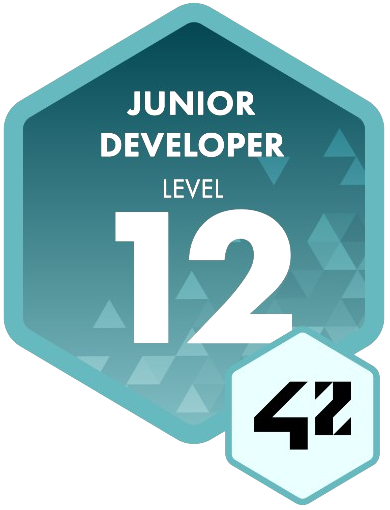
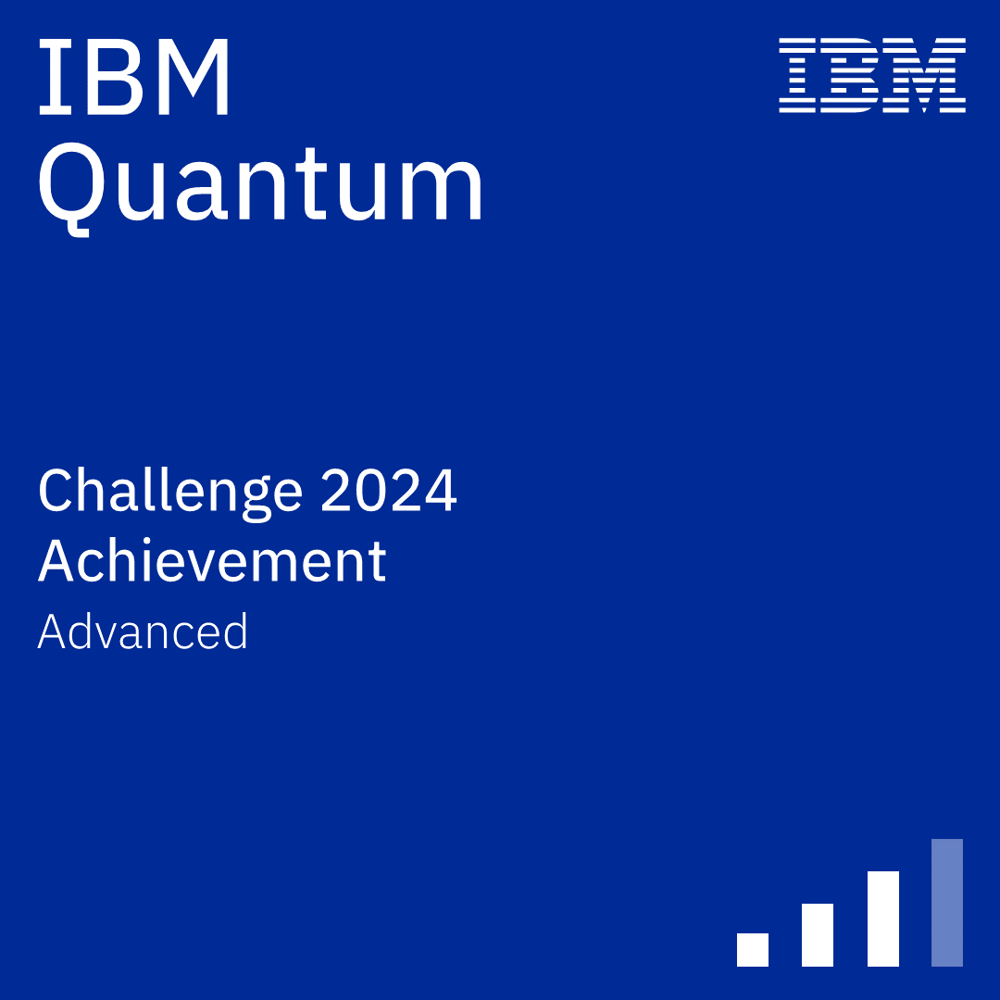

# **✨ About me**

👋 Hi, I’m Diego Gerwig

🦺 Civil Engineer specialized in Data Science and Software Development. 

💻 Experienced in integrating digital solutions into engineering projects, I lead digital transformation initiatives with agile methodologies and data analysis.

📊 My approach combines precision and technological innovation to develop scalable, efficient systems.

---

## **📫 How to reach me**

	
	
	
	<!--  -->
	

---

## **🛠️ Tools & Skills**

<h3 align="left">👨‍💻 LANGUAGES</h3>
	

		
	  	
	  	
	  	
	  	
	  	
	  	
	  	
	

<h3 align="left">📈 DATA SCIENCE</h3>
	

		
		
		
		
		
		
		
		
		
		
		
	

<h3 align="left">🛢️ DATABASES</h3>
	

		
		
		
		
		
		
	

<h3 align="left">🖥️ WEB</h3>
	

		
		
		
		
		
	

<h3 align="left">🧩 TOOLS</h3>
	

		
		
		
		
		
		
		
		
		
	

---

 
   
<h2>🏆 Licenses & Certifications </h2>

   <h3>42 Network</h3>
	   

		   
	   

   <h3>Quantum Computing QClass 2023-2024</h3>
	   
	   
	    
		<!--  -->
		<!--  -->
	<h3>IBM Quantum</h3>
		
		
		
	<!-- <h3>LeetCode</h3>
		
		&nbsp;&nbsp;&nbsp;&nbsp;&nbsp;
		 -->

---

	
<h2>📊 Stats & Activity</h2>

	

		
		
		<!--  -->
		 
		 
		
		 
		   
		 
		 
		
	

